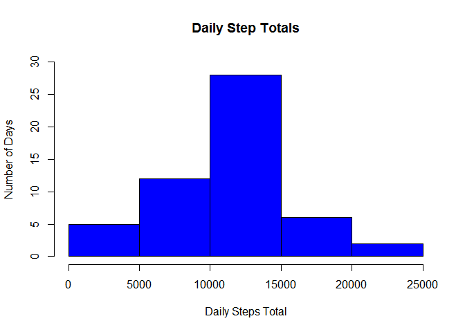
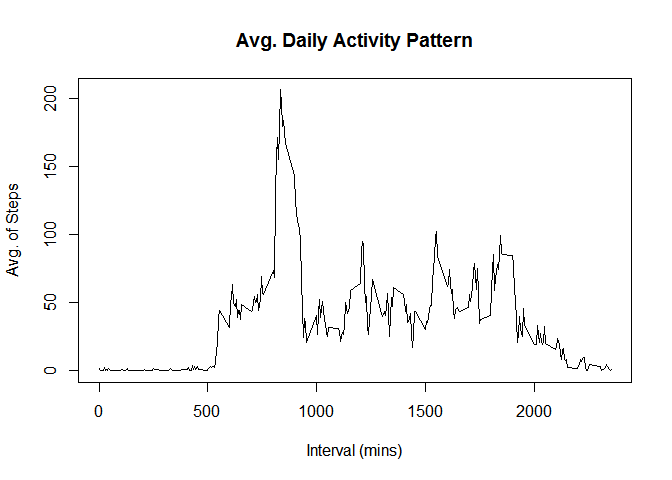
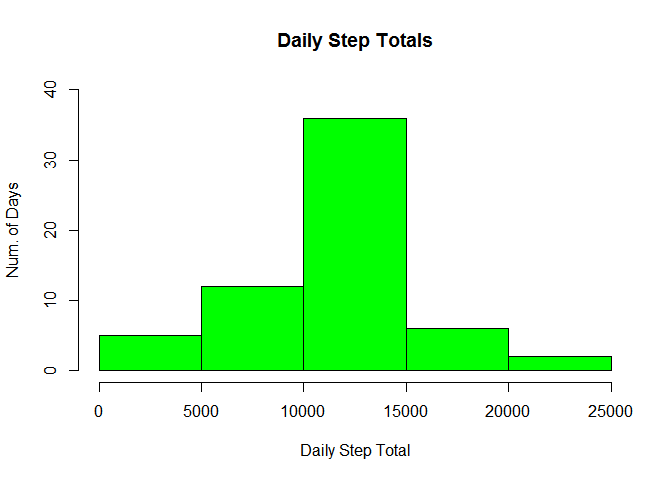
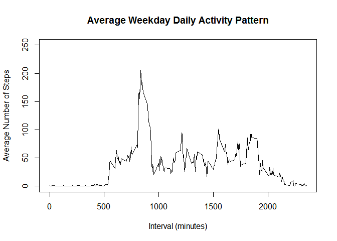

# Reproducible Research: Peer Assessment 1
Sunday, June 14th, 2015  


## Loading and preprocessing the data
---------------------------------------------------------------
For this assignment 
-First it loads all data from csv file
-It replace NA values with the mean value
-Then it uses aggregate funtion to group information
-It assigns columns names
-Creates a barplot 


```r
original_data <- read.csv("activity.csv", colClasses=c(date="Date"));
sum_data <- tapply(original_data$steps, original_data$date, sum);
```

## What is mean total number of steps taken per day?
---------------------------------------------------------------
-NA values are not excluded in this graphic, so mean value is different

```r
hist(sum_data, xlab = "Daily Steps Total", ylab = "Number of Days", main = "Daily Step Totals", col = "blue", ylim = c(0,30));
```

 

```r
## Total steps mean and median
mean(sum_data, na.rm=TRUE);
```

```
## [1] 10766.19
```

```r
median(sum_data, na.rm=TRUE);
```

```
## [1] 10765
```

## What is the average daily activity pattern?
---------------------------------------------------------------
-Graphic created on dates so I created a two columns dataframe one column contains timestamp and the other step values

```r
mean_act_data <- aggregate(original_data$steps ~ original_data$interval, FUN = "mean");
colnames(mean_act_data) <- c("interval","steps");
plot(mean_act_data, type="l", xlab = "Interval (mins)", ylab = "Avg. of Steps", main = "Avg. Daily Activity Pattern")
```

 

```r
with(mean_act_data,interval[steps==max(steps)])
```

```
## [1] 835
```

```r
max(mean_act_data[,2])
```

```
## [1] 206.1698
```

## Imputing missing values
---------------------------------------------------------------
-In this graphic I replace NA with average value, and as we could se mean and median are modified

```r
summary(original_data$steps)
```

```
##    Min. 1st Qu.  Median    Mean 3rd Qu.    Max.    NA's 
##    0.00    0.00    0.00   37.38   12.00  806.00    2304
```

```r
original_miss_data <- merge(original_data, mean_act_data, by.x="interval", by.y="interval")
original_miss_data$steps.x[is.na(original_miss_data$steps.x)] <-original_miss_data$steps.y[is.na(original_miss_data$steps.x)]

mergesum_data <- tapply(original_miss_data$steps.x, original_miss_data$date, sum);
hist(mergesum_data, xlab = "Daily Step Total", ylab = "Num. of Days", col="green", main ="Daily Step Totals", ylim = c(0,40));
```

 

```r
mean(mergesum_data);
```

```
## [1] 10766.19
```

```r
median(mergesum_data);
```

```
## [1] 10766.19
```

## Are there differences in activity patterns between weekdays and weekends?

```r
week_days <- weekdays(original_miss_data$date);
pattern_data <- cbind(original_miss_data,week_days);
pattern_data2 <- ifelse (pattern_data$week_days %in% c("Saturday","Sunday"), "weekend", "weekday");
pattern_data <- cbind(pattern_data, pattern_data2);
weekday <- pattern_data[pattern_data$pattern_data2=="weekday",];
weekday_agg <- aggregate(weekday$steps.x ~ weekday$interval, FUN = "mean")

plot(weekday_agg, type="l", xlab = "Interval (minutes)", ylab = "Average Number of Steps", main = "Average Weekday Daily Activity Pattern", ylim = c(0,250))
```

 
